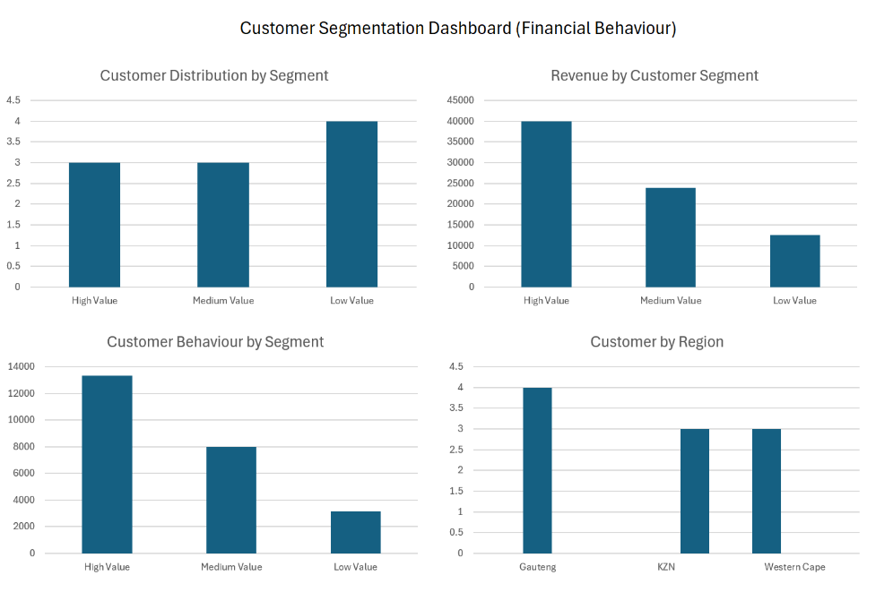

# Customer Segmentation (Financial Behaviour Analysis)

## Overview
This project analyzes customer financial behaviour by segmenting customers into high-value, medium-value, and low-value groups based on transaction activity and spending patterns.

The analysis was conducted using Excel, SQL, and Python.

---

## Tools Used
- Microsoft Excel  
- SQL (analytical queries)  
- Python (pandas, matplotlib)

---

## Key Insights
- High-value customers generate the highest revenue and show the strongest engagement.
- Medium-value customers present growth opportunities.
- Low-value customers contribute less revenue and show lower activity levels.
- Customer behaviour varies across regions.

---

## Dashboard Preview

